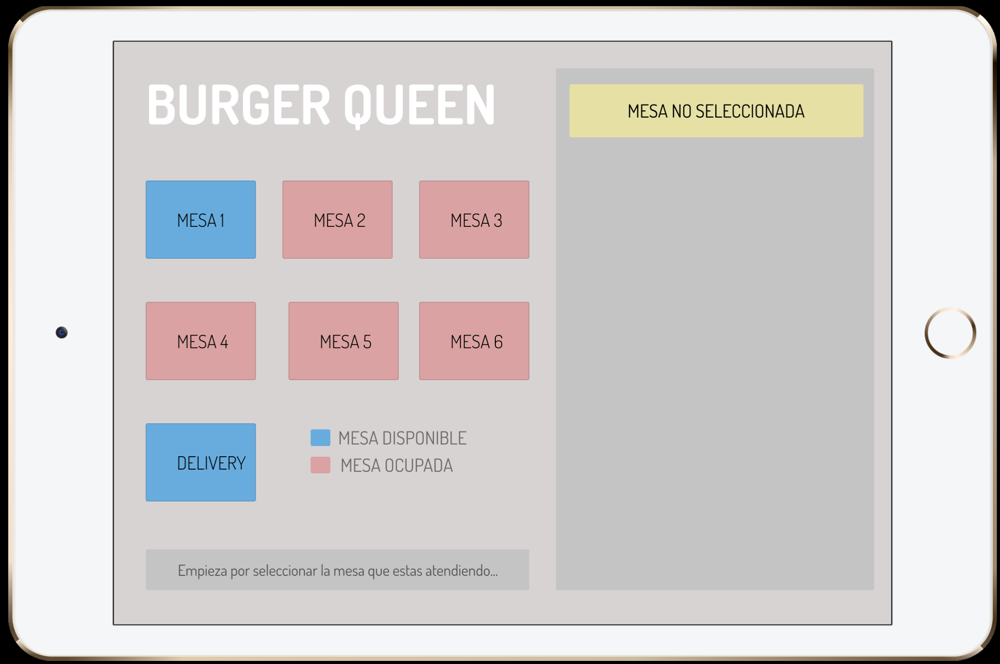
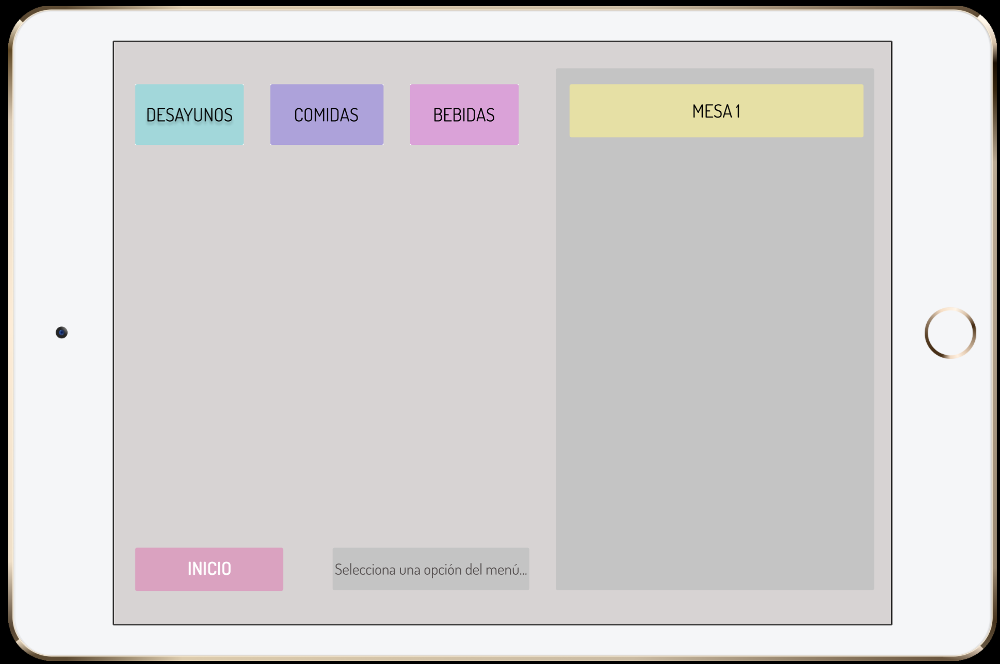
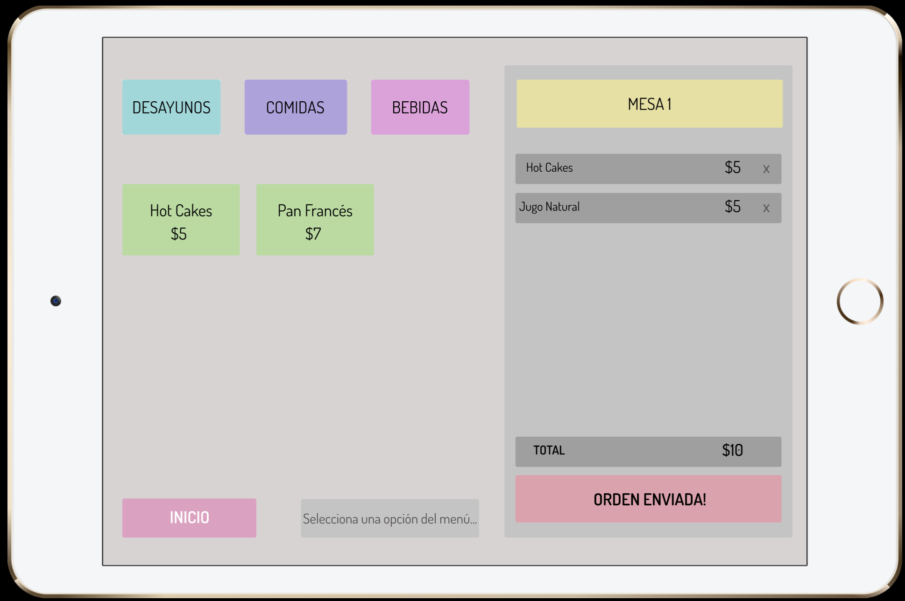
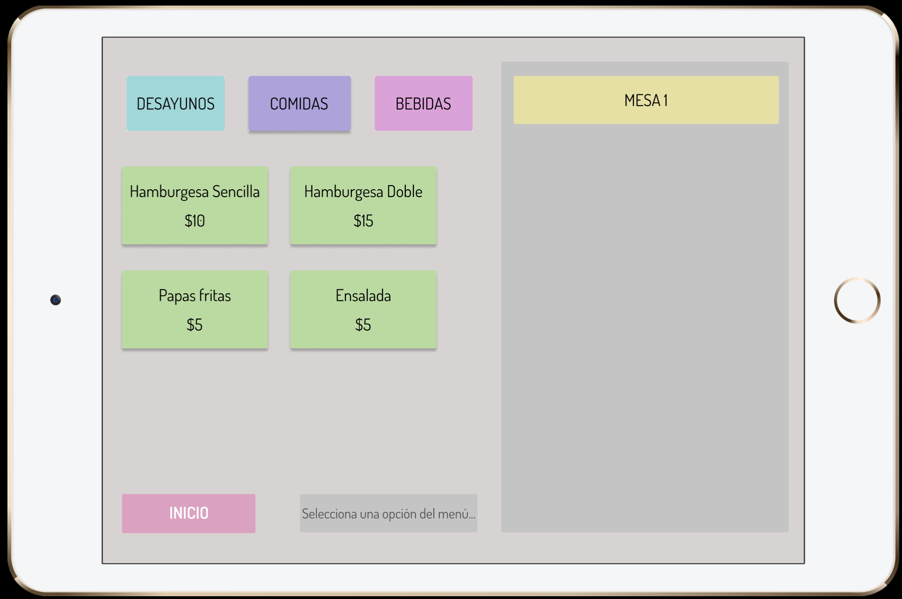
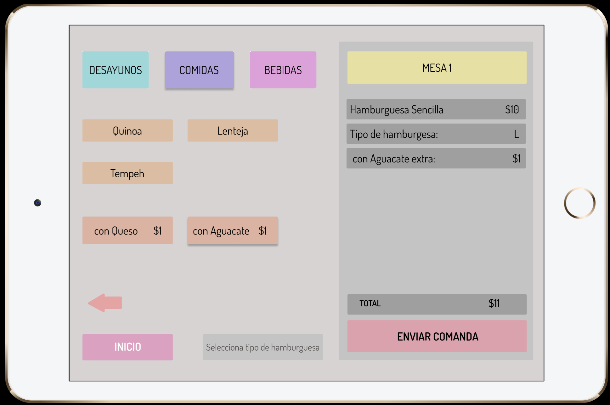
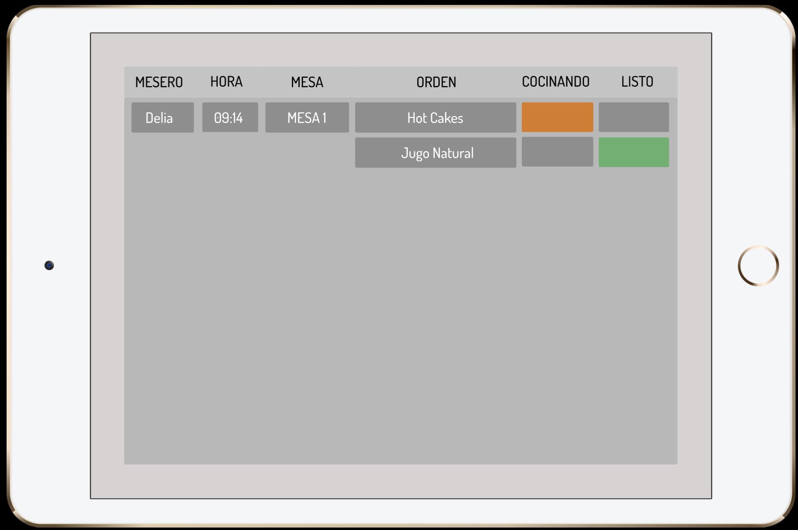

# Burger Queen

Es una interfaz web creada para un pequeño restaurante de hamburguesas en crecimiento en la que los meseros pueden tomar pedidos usando una _tablet_, y enviarlos a la cocina para que se preparen ordenada y eficientemente.

## Prototipo De Alta Fidelidad

Pantalla de Inicio
[Inicio](images/Home.png)

Servicio

Opciones

Desayunos

Comidas

Extras

Cocina
